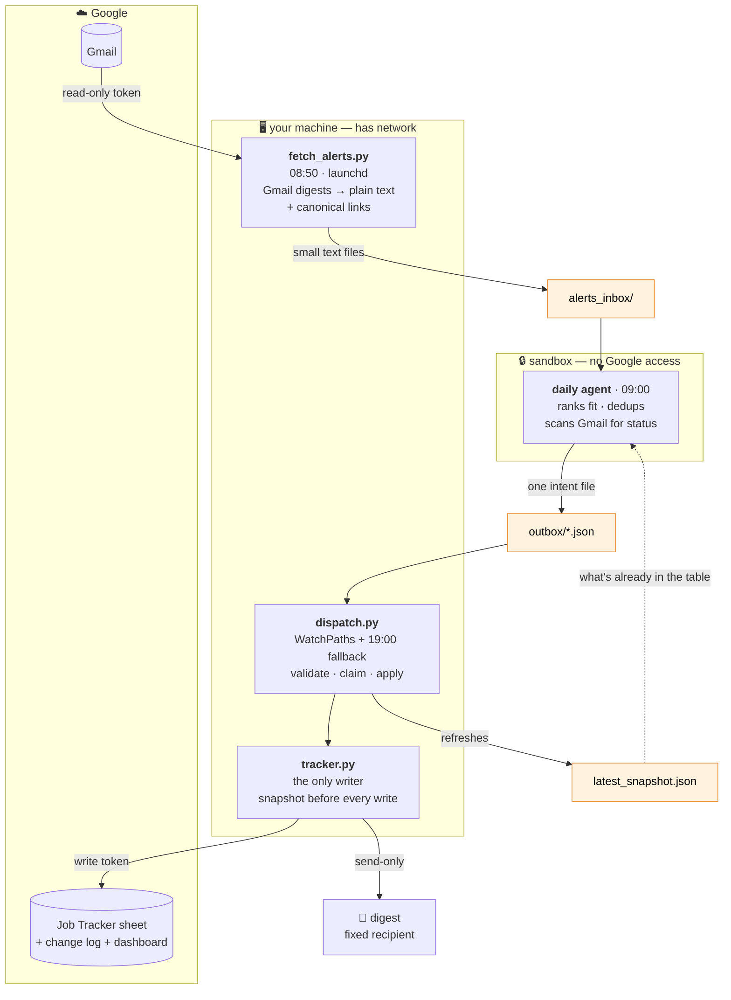

# Architecture — how the tracker actually works

The data flow between the daily agent, the scripts on your machine, and the
Google Sheet.

---

## The core idea: the sandbox boundary

Everything in this system follows from one fact: **the daily agent runs in an
isolated VM that blocks access to `googleapis.com`.** It cannot read the sheet
and it cannot write to it.

The fix is not to defeat the sandbox — it's to live with it. **Processes on your
machine (which do have network) carry information to the agent in advance, and
carry its decisions out afterwards.** Both directions move through files on
disk: directories acting as message queues.

| Direction | Directory | Written by | Read by |
|---|---|---|---|
| inbound, to the agent | `alerts_inbox/` | `fetch_alerts.py` | the agent |
| inbound, to the agent | `latest_snapshot.json` | `dispatch.py` | the agent |
| outbound, from the agent | `outbox/*.json` | the agent | `dispatch.py` |

This is why the agent never "updates the sheet". It only ever **declares intent**
in a JSON file.

The orange boxes are the queues. They are the entire interface between the
sandbox and the outside world.

---

## The components

### `fetch_alerts.py` — 08:50, before the agent
Pulls job-alert digests from Gmail (Indeed, LinkedIn, whichever boards you
configure), strips HTML to readable text, extracts canonical job links, and
writes one small file per digest into `alerts_inbox/`.

- **Why it exists:** without it the agent read raw HTML through the Gmail API,
  which caused a token blow-up — one run hit ~19M tokens, about double a normal
  day, with a sub-agent stuck in 129 rounds of regex over a single email.
  Parsing is mechanical work. Give it to Python, not to the model.
- **ledger:** `processed_threads.jsonl` prevents pulling the same thread twice.
- **state per email:** a file in `alerts_inbox/` = not yet processed · in `done/`
  = processed. A crash loses nothing — the file simply stays and is picked up on
  the next run.
- **separate OAuth:** `token_read.json`, read-only. Deliberately not the
  `tracker.py` token, so a scope change here can't break automated dispatch.
- **triggering:** launchd at 08:50, plus WatchPaths on `fetch_trigger/` — the
  agent can ignite a pull itself if the 08:50 run was missed (machine asleep).

### the daily agent — 09:00, inside the sandbox
Reads `alerts_inbox/`, reads `latest_snapshot.json` (to know what's already in
the table), and scans boards and company career pages directly. Ranks fit,
detects duplicates, scans Gmail for status updates — and writes **a single
intent file** to `outbox/`.

File shape: `{upserts, updates, flags, email_md, email_subject, activity_gmail}`.

Its full instructions: `AGENT_INSTRUCTIONS.example.md`.

### `dispatch.py` — the bridge back
Runs on your machine, where there is network. Takes each file from `outbox/` and
applies it.

- **file lifecycle:** `outbox/` → `processing/` (claim) → applied → `done/` or
  `failed/`. A file stuck in `processing/` (interrupted run) is requeued next run.
- **lockfile** `.dispatch.lock` prevents two dispatchers at once.
- **one consolidated email** per cycle — not one per action.
- **at the end of every run** it refreshes `latest_snapshot.json` and the
  RECENT ACTIVITY block on the dashboard — even when the outbox was empty. That
  is how the loop closes back to the next agent run.
- **three ways to trigger:** WatchPaths on `outbox/` (fires within seconds — but
  only while the machine is awake) · a daily fallback run at 19:00 ·
  `run_now.sh` by hand.

### `tracker.py` — the only writer
Every write to Google Sheets goes through it. It saves a snapshot before every
write, never deletes rows, and never rewrites a sheet.

Commands: `read` · `upsert-jobs` · `update-status` · `flag` · `notify` ·
`reformat` · `resort` · `dashboard-activity`

---

## Things worth remembering

**The schema is positional and rigid.** `KEYS`/`COLUMNS`/`COL`/`NCOLS` assume
every column sits at a fixed index. **Never add a column by hand in the sheet** —
it shifts everything after it, and the code will keep reading and writing the old
positions **silently, with no error**. Add columns through a migration script
that moves the physical columns first, then updates the schema in code.

**Columns owned by you, that the agent is blocked from:** `My Move`,
`Salary Range`, `Hybrid` (enforced in code — `MANUAL_ONLY_KEYS`). `Stage` — the
agent fills it only when empty. `Hiring Process` — append only, via
`process_append`.

**`Priority` is a written number, not a live formula.** It updates only when
`_resort` runs. Editing `Stage`/`My Move` by hand does not re-sort the table
until a resort runs. (It has to be a number: a formula that references its own
row number breaks the moment `sortRange` moves the rows.)

**Two OAuth tokens on purpose:** `token.json` (write, `tracker.py`) and
`token_read.json` (read-only, `fetch_alerts.py`).

---

## Why a hand-drawn diagram and not a code-analysis tool

Static analysis tools map **function calls** — who calls whom inside the code.

The interesting part of this system isn't that. It's the launchd timers, the
directories used as message queues, the sandbox boundary, and the two OAuth
tokens. **None of those are function calls**, so a code graph structurally cannot
see them. Hence a diagram written by hand.
