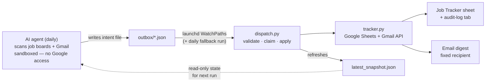

# Job Search Agent

An automated job-search pipeline: an AI agent scans job boards and Gmail daily, and a
dispatcher applies its findings to a Google Sheets tracker — with dedup, an audit log,
snapshots before every write, and a daily email digest.

Built to run a real job search, and built around one hard constraint: **the AI agent runs
in a sandbox that cannot reach Google APIs.** The solution is an outbox pattern — the agent
only writes local intent files; a separate dispatcher with network access applies them.

## Architecture

- **`tracker.py`** — the only component that writes to Google Sheets. Commands:
  `read`, `upsert-jobs`, `update-status`, `flag`, `notify`, `reformat`.
- **`dispatch.py`** — triggered by launchd the moment an outbox file appears
  (WatchPaths), with a daily calendar run as a safety net. Validates, claims files
  atomically (`outbox/ → processing/ → done|failed/`), applies them via `tracker.py`,
  sends one consolidated email per cycle, and refreshes the snapshot the sandboxed
  agent reads.

## Design decisions

**Safety rails around an autonomous agent writing to real data:**

- **The script never deletes rows or rewrites the sheet.** Every command is additive or
  cell-targeted, and a JSON snapshot of the whole table is saved before every write
  (30-day retention).
- **Column ownership.** The human's decision column belongs to the human — the agent
  never writes it. The pipeline-stage column is human-first: the agent fills it only
  when empty. On any conflict between the sheet and what the agent found in Gmail, it
  **flags** the row (orange highlight + reason) instead of overwriting. Uncertainty
  surfaced beats confident overwrites.
- **Fixed email recipient**, hardcoded — the agent cannot be tricked into mailing
  anyone else. OAuth scopes are minimal (`gmail.send` only — no read).
- **Every change is logged** to an audit-log tab, newest first, with old → new values —
  so any automated change can be reviewed and reverted.
- **Failures are loud.** Invalid outbox files go to `failed/`, unmatched updates are
  reported, and both reach the email digest — nothing fails silently. Files orphaned
  by an interrupted run are re-queued automatically.

**Dedup** uses two keys: normalized `company + title` (location tokens and noise words
stripped), and a link identity that extracts job-ID query params (`jk=`, `JobID=`,
`gh_jid=`, …) so different jobs on the same board never collapse into one.

**Priority sorting** is computed in Python (not sheet formulas, which break under
`sortRange`): active processes first, then human-marked actions, then applied-and-waiting,
then strong fits — rejected/irrelevant sink to the bottom.

## Stack

Python · Google Sheets API · Gmail API · macOS launchd · an AI agent (any — the contract
is just JSON files; see [AGENT_INSTRUCTIONS.example.md](AGENT_INSTRUCTIONS.example.md))

## Setup

See [SETUP.md](SETUP.md) (Hebrew): Google Cloud OAuth setup, sheet bootstrap, launchd
install. Copy `config.example.json` → `config.json` and `launchd.example.plist` →
`~/Library/LaunchAgents/`.

## Note

This is a personal project extracted from my own job-search system; the agent
instructions here are a sanitized template of the real ones. The sheet columns,
audit log, and email digest are **Hebrew-first by design** — the tracker is
built for the Israeli job market, with RTL-aware rendering in both the sheet
and the email.
