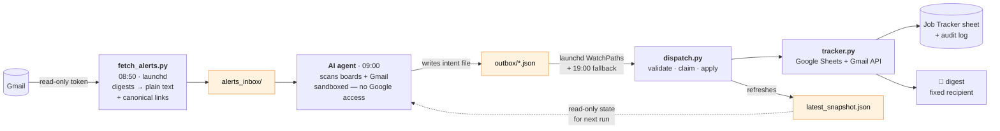

# Job Search Agent

An automated job-search pipeline: an AI agent scans job boards and Gmail daily,
and a dispatcher applies its findings to a Google Sheets tracker — with dedup, an
audit log, snapshots before every write, and a daily email digest.

Built to run a real job search, and built around one hard constraint: **the AI
agent runs in a sandbox that cannot reach Google APIs.** The answer is an outbox
pattern — the agent only writes local intent files; a separate dispatcher with
network access applies them.

**→ [GETTING_STARTED.md](GETTING_STARTED.md)** — what you need to supply to run
your own.
**→ [JOB_SOURCES.md](JOB_SOURCES.md)** — which sources actually work, and the
silent failures that make a healthy-looking pipeline deliver nothing.
**→ [ARCHITECTURE.md](ARCHITECTURE.md)** — how the pieces fit.

## Set it up by talking to it

Clone the repo, open it in [Claude Code](https://claude.com/claude-code), and say:

> Read GETTING_STARTED.md and set this up for me. Interview me for everything in
> the "what you supply" table, then walk me through SETUP.md.

## Architecture

The orange boxes are directories used as message queues. They are the whole
interface between the sandbox and everything else.

- **`fetch_alerts.py`** — pulls job-alert digests from Gmail before the agent
  runs, strips them to plain text, and extracts canonical job links.
- **`tracker.py`** — the only component that writes to Google Sheets. Commands:
  `read`, `upsert-jobs`, `update-status`, `flag`, `notify`, `reformat`,
  `resort`, `dashboard-activity`.
- **`dispatch.py`** — triggered by launchd the moment an outbox file appears
  (WatchPaths), with a daily calendar run as a safety net. Validates, claims
  files atomically (`outbox/ → processing/ → done|failed/`), applies them via
  `tracker.py`, sends one consolidated email per cycle, and refreshes the
  snapshot the sandboxed agent reads.

## Design decisions

**Safety rails around an autonomous agent writing to real data:**

- **The script never deletes rows or rewrites the sheet.** Every command is
  additive or cell-targeted, and a JSON snapshot of the whole table is saved
  before every write (30-day retention).
- **Column ownership.** Your decision column belongs to you — the agent never
  writes it. The pipeline-stage column is human-first: the agent fills it only
  when empty. On any conflict between the sheet and what the agent found in
  Gmail, it **flags** the row (orange highlight + reason) instead of overwriting.
  Salary and work-arrangement columns are blocked from the agent in code.
  Uncertainty surfaced beats confident overwrites.
- **Fixed email recipient**, hardcoded — the agent cannot be tricked into mailing
  anyone else. OAuth scopes are minimal, and split: the writer holds
  `gmail.send` only (it cannot read your mail), while the alert fetcher holds a
  separate read-only token.
- **Every change is logged** to an audit-log tab, newest first, with old → new
  values — so any automated change can be reviewed and reverted.
- **Failures are loud.** Invalid outbox files go to `failed/`, unmatched updates
  are reported, and both reach the email digest — nothing fails silently. Files
  orphaned by an interrupted run are re-queued automatically.

**Parsing belongs in Python, not in the model.** Before `fetch_alerts.py`
existed, the agent read raw digest HTML through the Gmail API — one run burned
~19M tokens, roughly double a normal day, with a sub-agent stuck in 129 rounds of
regex over a single email. Mechanical work now happens in a host script that
writes small text files; the agent only applies judgement.

**Dedup** uses three keys: normalized `company + title` (location tokens and
noise words stripped), a link identity that extracts job-ID query params (`jk=`,
`gh_jid=`, …) so different jobs on one board never collapse into one, and — for
the case where the same job arrives under a legal-entity name and a brand name —
identical title plus a shared numeric job id.

**Priority sorting** is computed in Python, not as a sheet formula (a formula
that references its own row number breaks under `sortRange`): active processes
first, then what you marked for action, then applied-and-waiting, then strong
fits — rejected and not-relevant sink to the bottom.

## Stack

Python · Google Sheets API · Gmail API · macOS launchd · an AI agent (any — the
contract is just JSON files; see
[AGENT_INSTRUCTIONS.example.md](AGENT_INSTRUCTIONS.example.md))

## Setup

[SETUP.md](SETUP.md) — Google Cloud OAuth, sheet bootstrap, launchd install.
Copy `config.example.json` → `config.json` and `launchd.example.plist` →
`~/Library/LaunchAgents/`.

## Note

This is a personal project, extracted and generalised from the system I run for
my own job search. The agent instructions here are a sanitised template of the
real ones, and the personal content — profile, pipeline, company notes — is not
included by design; see [GETTING_STARTED.md](GETTING_STARTED.md) for what to
put back.
